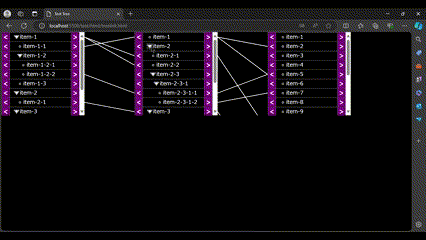

# oooTreeLinks

## TreeLink
Sample Image



```typescript
tree1 = new treelink.OooTreeLink(
  svg, // SVG element
  "../icon/" // Icon path
);

tree1.setData({
  datalist: [
    {
      name: "tree1",
      items: [
        { id: "1", parent: "", info: "item-1" },
        // ...
      ],
    },
    {
      name: "tree2",
      items: [
        { id: "1", parent: "", info: "item-1" },
        // ...
      ],
    },
    {
      name: "tree3",
      items: [
        { id: "1", parent: "", info: "item-1" },
        // ...
      ],
    },
  ],
  linklist: [
    {
      from: "tree1",
      to: "tree2",
      links: [
        { from: "1", to: "1" },
        // ...
      ],
    },
    {
      from: "tree2",
      to: "tree3",
      links: [
      links: [
        { from: "1", to: "1" },
        // ...
      ],
      ],
    },
  ],
});
```